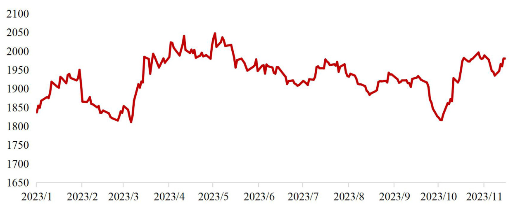

# 全球经济金融展望报告  

2024年年报（总第57期）  

报告日期：2023年12月12日  

# 要点  

●2023 年全球经济增长动力持续回落，各国复苏分化，发达经济体增速明显放缓，新兴经济体整体表现稳定。全球贸易增长乏力，各国生产景气度逐渐回落，内需对经济的拉动作用减弱。欧美央行货币政策紧缩态势放缓，美元指数高位震荡后走弱，全球股市表现总体好于预期，但区域分化明显。高利率环境抑制债券融资需求，债券违约风险持续上升。  

$\bullet$ 展望2024 年，预计全球经济复苏将依旧疲软，主要经济体增长态势和货币政策走势将进一步分化。欧美央行大概率结束本轮紧缩货币周期，美元指数将逐步走弱，流向新兴经济体的跨境资本将增加。国际原油市场短缺格局或延续，新能源发展成为重点。  

$\bullet$ 海湾六国经济发展与投资前景、高利率和高债务对美国房地产市场脆弱性的影响等热点问题值得关注。  

  
主要经济体GDP 增速变化趋势（%）  
资料来源：IMF，中国银行研究院  

# 中国银行研究院全球经济金融研究课题组  

  

联系人：王有鑫  
电话：010-66594127  
邮件： wangyouxin_hq@bank-of-china.com  

# 全球经济复苏疲软，货币政策取向分化  

——中国银行全球经济金融展望报告（2024年）  

2023年，全球经济增长动力持续回落。分区域看，各国复苏存在较大差异，发达经济体增速明显放缓，新兴经济体增速与2022年大致持平。生产端，全球供应链持续恢复，但生产景气度逐渐回落。需求端，内需对经济的拉动作用逐渐减弱，各国国内投资和跨境投资均持续承压；全球货物贸易量指数和价格指数下行，主要经济体出口贸易同比增速下降。欧美央行货币政策延续收紧态势，但步伐整体放缓；金融体系短期资金运行发生结构性变化，“去存款化”特征突出。美元指数高位震荡后走弱，全球股市表现总体好于预期，但区域分化显著。高利率环境抑制债券融资需求，债券违约风险持续上升，美国政府债务可持续性问题引发市场关注。展望2024年，预计全球经济复苏将依旧疲软，主要经济体增长态势和货币政策将进一步分化。欧美央行大概率结束本轮加息周期，日本央行可能退出负利率政策，跨境资本回流美国趋势将放缓，流向新兴经济体的资金将增加。美元指数将逐步走弱，新兴经济体货币汇率有望回升。国际原油市场短缺格局或延续，新能源发展成为重点。本期报告分别对海湾六国经济发展与投资前景、高利率和高债务对美国房地产市场脆弱性的影响两个专题展开分析。  

# 一、全球经济回顾与展望  

# （一）全球经济将在波动分化中筑底复苏  

2023年，全球经济增长动力持续回落，经济增速连续两年下降。受地缘政治冲突、高通胀、货币政策紧缩等因素影响，全球经济下行压力加大。预计2023年全球GDP增速为 $2.7\%$ （市场汇率法），较2022年下降0.3个百分点。  

  
图1：全球GDP增速 $(\%)$ ）  

资料来源：IMF，中国银行研究院  

分区域看，全球经济复苏不均衡，各国存在较大差异。发达经济体增速明显放缓，预计2023年增速较2022年下降1个百分点。其中，欧元区和英国经济增速大幅下降，美国表现好于其他发达经济体。2023年三季度，欧元区和英国GDP环比增速均由之前的正增长转为负增长，分别下降 $0.1\%$ 和 $0.03\%$ ；美国GDP环比增长折年率为 $4.9\%$ ，比二季度增速高2.8个百分点。新兴经济体增速与2022年大致持平，预计2023年增速比2022年下降0.1个百分点。其中，东南亚等出口型经济体增长承压，拉美、非洲等大宗商品出口国增速放缓，中东欧国家经济增速加快（图2）。  

  
图2：主要经济体GDP增速变化趋势（%）  
注：东盟五国包含印度尼西亚、马来西亚、菲律宾、新加坡和泰国。  

资料来源：IMF，中国银行研究院  

从生产端看，全球供应链持续恢复，但生产景气度逐渐回落。截至2023年10月底，纽约联储全球供应链压力指数降至有记录以来的最低值。荷兰经济分析局数据显示，全球工业生产量于4月触及年内低位，5-8月逐月回升，但发达经济体和新兴经济体分化明显（图3）。其中，主要新兴经济体工业生产指数普遍走高，如俄罗斯、土耳其、南非等，而发达经济体中的美国和韩国回升，英国、德国、意大利下行，日本波动较大，整体趋于平稳。全球融资环境收紧和经济下行压力对工业生产前景带来较大影响，全球制造业PMI指数明显回落，从2月的 $49.9\%$ 降至10月的 $48.8\%$ 。  

  
图3：部分经济体工业生产指数变化趋势（2010年 $\mathbf{-100}\rangle$ ）  
资料来源：荷兰经济分析局，中国银行研究院  

从需求端看，内需是支撑发达经济体增长的主要动力，但对经济的拉动作用逐渐减弱。美国消费未受加息明显影响，私人消费维持稳定增长，前三季度对美国经济增长的贡献率高达 $64.4\%$ ；8-9月，美国零售和食品销售额连续两个月环比增速保持在 $0.7\%$ 以上，高于市场预期，但10月增速大幅回落至 $-0.1\%$ 。欧洲各国消费指数整体维持稳定（图4），是上半年免于陷入衰退的主要动力。但随着高利率和高通胀持续，对消费的影响逐渐释放，内需增长动力逐渐弱化，全球服务业PMI指数从二季度开始明显回落，从5月的 $55.5\%$ 降至10月的 $50.4\%$ 连续5个月下行；OECD消费者信心指数从7月开始连续3个月回落。  

  
图4：部分欧洲国家零售销售指数  
注：除英国是以2019年为基年外，其他经济体均为2015年为基年。资料来源：Wind，中国银行研究院  

发达经济体投资受加息政策影响较大，国内投资和跨境投资均持续承压。美国私人投资在2023年一季度触底后逐渐反弹，三季度存货及住宅投资恢复增长，带动私人投资增速提升至 $8.4\%$ （经季调后环比折年率），但制造业和设备投资均放缓，环比增长折年率分别降低 $0.1\%$ 和 $3.8\%$ 。欧盟投资增速放缓，房地产投资减少。2023年二季度，欧元区固定资本形成总额环比增长 $0.1\%$ ，比一季度增速下降0.3个百分点，房地产对GDP环比增长拉动率转为负值。在紧缩货币政策影响下，发达经济体企业部门宏观杠杆率下降，企业加杠杆或负债投资意愿不足。同2022年底相比，2023年二季度，美国、英国、法国、意大利和德国非金融企业部门负债率分别下降了2.4个、3.4个、4.0个、3.0个和1.3个百分点（图5）。IMF预测2023年全球投资率（投资占GDP的比重）将下降1.0个百分点至 $26.4\%$ （图6），其中，欧盟将下降1.1个百分点，比发达经济体平均降幅高0.2个百分点。从跨境投资角度看，受地缘政治局势紧张、金融领域动荡加剧、高利率和投资审查趋严等影响，并购交易仍然疲软，而在全球产业链重塑背景下，东南亚等区域绿地投资恢复增长。联合国贸发会议预计2023年全球跨境直接投资将继续下行，但降幅较2022年收窄。  

  
图5：部分发达国家非金融企业部门债务率（%）  
资料来源：IIF，中国银行研究院  
图6：全球投资率变化趋势 $(\,\%)$ ）  

  
资料来源：IMF，中国银行研究院  

从国际贸易角度看，全球货物贸易量和价格指数均承压下行，主要经济体出口贸易同比增速下降。荷兰经济分析局数据显示，2023年1-8月，全球货物贸易量指数和价格指数均震荡下行，8月数值比1月分别下降0.9个和4.3个点（图7）。10月，世贸组织将2023年全球货物贸易增速预测值下调0.9个百分点至 $0.8\%$ ，2023年国际贸易增长或为近几年最低水平。但近期东亚、东南亚等主要经济体出口下行趋势收窄，贸易呈现企稳迹象。9-10月，越南出口结束连续10个月的负增长态势，同比分别增长 $5.0\%$ 和 $6.7\%$ 。10月，韩国出口同比增长 $5.1\%$ ，是自2022年10月以来首次正增长。  

  
图7：全球货物贸易量指数和货物贸易价格指数（2010年 $\mathbf{-100}.$ ）  
资料来源：荷兰经济分析局，中国银行研究院  

# 展望2024年，预计全球经济复苏将依旧疲软，且分化可能加剧。  

一是发达经济体面临的“遏通胀和稳增长”两难问题更加突出，货币政策走势将分化。疫后服务业复苏加快、劳动力市场紧平衡、地缘冲突加剧等因素导致发达经济体核心通胀黏性较强，通胀回落速度较慢。2023年10月，IMF将2024年全球通胀预测值由7月的 $5.2\%$ 上调至 $5.8\%$ ，并预测到2025年前大多数国家的通胀率都将高于央行目标。通胀反复风险使当前各主要央行对通胀走势保持警惕，预计在一段时间内政策利率将继续维持在高位。但随着经济下行压力加大，主要经济体央行货币政策走势将逐渐分化。截至11月中旬，在Macrobond跟踪的79家央行中，近1/5正处于降息周期。预计美联储大概率在2024年上半年停止加息，日本央行在通胀压力下可能于2024年年初退出负利  

率政策。  

二是各国经济走势将进一步分化。相较于新兴市场和发展中经济体，发达经济体面临更大的经济增长压力。受就业市场韧性消退、内外部需求回落、通胀和利率水平高企、地缘冲突余波未散等因素影响，欧元区和英国面临更大的通胀压力，经济表现将弱于其他主要发达经济体，不过随着增长压力加大，货币政策可能将在2024年上半年率先转向，经济表现虽疲弱但可能会好于2023年。美国经济处于下行阶段，2024年经济“软着陆”和衰退风险同时存在，但目前来看，经济实现“软着陆”概率更大。中国和其他亚太经济体经济走势有望逐渐企稳，将成为稳定全球经济的重要力量。  

三是需求端下行压力可能大于生产端。2023年全球工业生产在触底后缓慢回升，自4月起全球工业生产指数整体呈增长趋势，随着疫情引致的供给侧冲击进一步消退，预计2024年全球供应链和工业生产将继续在波动中复苏。但在高通胀、高利率、高债务背景下，居民家庭资产负债表状况将逐渐变差，紧缩性货币政策对需求端的滞后影响将逐步显现，支撑2023年经济增长的需求端因素可能在2024年面临加速回落的压力。  

与此同时，一些稳定因素将逐渐显现，对经济形成托底，减缓经济下行幅度。整体上看，随着供应链和工业生产逐步恢复正常，全球供求形势将得到持续改善，通胀虽然顽固但整体回落趋势不会逆转。主要经济体的加息周期将逐渐停止甚至开始转向，全球流动性紧缩情况预计将逐步缓解。结合全球产业链重组背景，流向新兴经济体的跨境直接投资和证券投资预计将有所回升。分区域看，中国经济复苏动力逐渐增强，亚太等出口型经济体增长逐渐企稳，将为全球经济复苏提供重要支撑。随着宏观政策效应逐步释放，中国经济呈稳定复苏态势，带动相关经贸伙伴贸易回暖，叠加半导体产业步入复苏周期，韩国、越南等亚太地区出口导向型经济体表现将有所好转。  

综合上述因素，“复苏 $^+$ 分化”将成为2024年全球经济主线逻辑，预计全年经济增速在 $2.5\%$ 左右，增速比2023年低0.2个百分点。  

# （二）重点国别/地区经济形势研判  

1.美国经济增速将回落，高利率对经济的滞后影响将逐步显现  

2023年前三季度美国经济未受加息明显冲击，出现超预期增长。一、二季度GDP环比增长折年率分别为 $2.2\%$ 和 $2.1\%$ ，处于潜在增速附近，三季度大幅提高至 $4.9\%$ ，为2022年以来最好季度表现（图8）。其中，私人消费和政府财政支出是支撑美国经济增长的重要驱动力，前三季度上述两分项对美国经济增长的贡献率分别为 $64.4\%$ 和 $23.5\%$ 。后疫情时代消费者在服务领域的压抑需求得到释放。服务支出成为消费者支出领域中最稳定和增幅最大的板块，前三季度服务消费贡献了私人消费增长的 $58.7\%$ 。这主要得益于美国就业市场的稳健，1-10月非农就业人数均值远高于历史水平，失业率平均值为 $3.6\%$ ，低于2022年同期和国会预算办公室估算的非周期性失业率水平。美国劳动者实际收入保持增长，个人实际可支配收入月同比增速均值达 $4.2\%$ ，家庭财务状况良好，家庭财富对个人支出的正面效应高于历史水平。财政支出对经济增长的带动作用上升。2023年美国政府推进实施《通胀削减法案》《芯片与科学法案》，加大对清洁能源、半导体等产业的财政支持力度，前三季度政府支出平均每季度拉动GDP环比增长折年率0.7个百分点，而2022年该数值为-0.1。私人投资触底反弹，对经济的提振作用逐渐增强。受美国积极的产业政策和产业链回流等因素影响，制造业投资在二季度之前保持稳定增长，很大程度上对冲了利率抬升对美国房地产投资的负面影响，弱化了加息对私人投资的冲击。三季度虽然制造业投资开始转弱，但房地产投资的快速恢复又再度稳定了私人投资形势。前三季度私人投资对美国GDP环比增长折年率的季度拉动率均值为 $0.2\%$ ，高于上年同期的 $-0.8\%$ 。净出口对美国经济的拖累效应减弱。2023年美元维持强势表现，前三季度货物进口支出下降 $6.0\%$ ，而全球需求疲软导致美国货物出口规模下降 $2.5\%$ ，进口降幅大于出口，带动贸易赤字收窄 $12.1\%$ 。  

  
图8：各分项对美国GDP环比增长折年率的季度拉动率变化趋势 $(\%)$ ）  
资料来源：Wind，中国银行研究院  

2023年四季度美国经济增长动力明显回落，更多领域的负面因素开始凸显，不同部门表现分化。一是对经济增长贡献最大的私人消费表现疲软。消费者支出增幅有所放缓，10月零售和食品销售环比增速由之前两个月的 $0.7\%$ 以上降至 $-0.1\%$ ，私人消费对经济支撑作用减弱。二是制造业投资和工业产出处于疲弱状态。三季度企业制造业投资在连续7个季度增长后转为下降，未来可能会进一步回落。 ISM 制造业 PMI 指数长期处于萎缩区间， 10 月数值较上个月大幅下降 2.3个百分点。三是美国就业市场也逐渐降温，10月新增非农就业人数较年内月度均值大幅减少，失业率提高至 $3.9\%$ ，工资增速放缓，在通胀高企背景下，居民可支配收入增长逐渐承压。四季度美国GDP环比增长折年率可能会回落至 $2\%$ 左右。  

预计2024年美国经济增速将进一步回落，“软着陆”和衰退的可能性同时存在，但从目前情况看，“软着陆”发生的可能性要高于衰退。货币政策是影响2024年美国经济走势的重要因素。2023年美国通胀已明显放缓，受基期效应减弱、住宅成本居高不下、全球地缘政治动荡加剧可能导致食品与能源价格反弹等因素影响，2024年美国通胀进一步回落至 $2\%$ 目标将遇到一定阻力，后续下行难度增大且具有反弹风险。当前，美联储货币政策路线尚不清晰，但市场基本达成几点共识：第一，当前的货币政策已经达到“限制性”水平；第二，美联储加息周期已临近尾声，大概率在2024年调整货币政策；第三，若无特殊风险事件发生，美联储可能在2024年维持当前缩表（QT）节奏。目前不确定的是高利率的持续时间与首次降息时点，以及潜在的货币政策“滞后效应”可能对经济带来的影响。  

对于私人消费来说，高利率对消费的负面影响将逐渐显现。2023年利率上升增加了美国家庭债务负担，家庭债务支出/可支配收入虽低于历史水平，但呈现上升态势。美国家庭债务余额拖欠率回升至 $3\%$ ，消费者借贷能力和意愿将有所下降，债务融资在消费者支出来源中的权重上升。叠加学生贷款暂停还款阶段结束以及疫情时期放宽福利资格计划结束，将使得消费者财务状况恶化并影响消费支出的可持续性。2024年随着美国劳动力市场紧张状况缓解，其对冲加息负面影响的调节效应将逐渐减弱。具有先导性的首次失业保险申请人数缓慢回升，就业增长可能进一步减速。堪萨斯联储劳工市场状态指数中的动能指数低于历史平均值，反映未来增长的乏力状态。未来劳动者收入增幅可能下降，收入对支出的支撑作用可能减弱。  

对于私人投资来说，金融条件虽仍相对宽松，但信贷条件逐渐收紧，银行业普遍提高了对各种规模企业的信贷标准，NFIB小企业乐观指数显示小企业信心仍然疲软。此外，耐用品订单持续疲弱，长期高利率和紧缩的金融条件迫使企业缩减投资。9月美国二手房销售额跌至十年来最低水平，未来在价格持续上升、房贷利率维持高位的背景下，住房负担能力将继续处于历史低位，销售预期可能持续遇冷。但另一方面，房屋供应量保持低位，可能促使建筑相关投资支出和商业活动复苏。综合来看，美国私人投资将继续呈现分化状态，企业投资可能持续疲软，房地产投资将从低位波动反弹。  

财政支出方面，美国2023财年所得税收入同比下降 $17\%$ ，反映出未来联邦支出能力下降且支出将更加依赖债务。在债务规模持续攀升、债务负担加重、大选周期国会两党博弈日益激烈的背景下，2024年美国政府削减财政支出可能性较大，对经济增长的提振作用将减弱，预计财政支出对GDP的拉动率将降至 $0.2\%$ 左右。  

净出口方面，随着美元指数逐渐回落，美国进口支出将增加，而随着欧元区经济增速回落，对欧出口可能小幅下降，美国贸易逆差可能再度扩大，对经济的拖累作用将上升。  

预计2024年美国经济增速为 $1.7\%$ ，较2023年下降0.7个百分点。  

# 2.欧洲经济增长动能不足，经济疲软表现将延续至2024年上半年  

2023年欧洲经济活动趋于停滞。在欧洲央行收紧货币政策、通胀高企抑制消费能力、疫情放开的促进效应逐步消减以及全球经济放缓导致出口疲软等多重因素影响下，欧元区经济增长乏力，前三季度欧元区GDP环比增速分别为 $0.0\%$ 、 $0.2\%$ 和 $-0.1\%$ 。10月欧元区综合PMI进一步下跌至 $46.5\%$ ，创2020年11月以来新低，商业预期和新订单指数进一步恶化，预示着未来欧元区经济前景仍然黯淡。在高利率和顽固通胀的影响下，英国经济增长走势也逐季下滑，前三季度GDP环比增速分别为 $0.3\%$ 、 $0.2\%$ 和0。  

  
图9：欧元区GDP环比增速、综合PMI及欧盟经济景气指数走势  
资料来源：Wind，中国银行研究院  

私人消费持续不振。月和8月欧元区平均零售额较二季度下降 $0.6\%$ ，8-10月消费者信心指数持续下降，远低于长期平均水平；三季度英国居民消费环比下降 $0.43\%$ 。融资条件收紧抑制了家庭借贷和消费支出增长，也影响了投资活动。二季度欧元区非建筑投资环比增长 $0.7\%$ ，但如果排除爱尔兰无形资产投资的数据波动，这一数字仅为 $0.4\%$ 。10月欧元区银行贷款调查显示，三季度企业对固定投资贷款的需求仍然低迷。住房投资也有所下降，6月欧元区住宅建筑许可证发放数量达八年来的最低点，7月和8月新注册的建筑公司数量也低于二季度水平；三季度英国固定资本形成总额环比增速由上季度的 $0.8\%$ 降至 $-2\%$ 。受全球市场需求减弱影响，欧元区进出口贸易增长乏力。1-9月，欧元区出口总额为2357.7亿欧元，同比下降 $9.4\%$ ；进口总额为2258亿欧元，同比下降 $23.9\%$ 。相较之下，英国出口在经历了上半年的连续负增长后，在三季度迎来反弹。  

通胀率持续下降，但对于居民生活仍带来压力。货币紧缩政策、能源价格回落等因素带动欧元区通胀压力持续缓解，2023年10月欧元区通胀率从1月的 $8.6\%$ 降至 $2.9\%$ ，创下2021年7月以来最低水平；同期英国通胀由 $10.1\%$ 降至 $4.6\%$ ，降幅同样明显，但核心通胀仍保持在 $5.7\%$ 的高位，全年走势先升后降，较欧元区而言英国通胀更加顽固。10月欧元区食品、酒精和烟草价格、服务业和非能源工业产品价格涨幅仍然明显，但能源价格同比大幅回落 $11.1\%$ ，很大程度上抵消了其他领域的价格压力。英国预算责任办公室指出，受通胀影响，英国民众以可支配收入衡量的生活标准在下一财年仍将较疫情前水平低 $3.5\%$ 。随着通胀和经济双双降温，欧洲央行加息之路基本宣告结束，但金融紧缩环境仍将持续，预计欧洲经济疲软表现还将延续。  

  
图10：欧元区通胀走势及结构（单位： $\%$ ）  
资料来源：欧盟统计局，中国银行研究院  

劳动力市场保持弹性，但经济活动疲软导致就业增长放缓。2023年上半年，欧元区就业保持较快增长，平均季度增长率为 $0.3\%_{\circ}\,8$ 月欧元区失业率为 $6.4\%$ ，与7月相比基本持平，保持在历史最低水平。但在经济活动持续疲软下，10月欧元区PMI就业指数为 $49.4\%$ ，就业人数自2021年1月以来首次下降。预计未来欧元区失业率将小幅上升。  

预计欧洲经济增长疲软势头将至少持续至2024年上半年，此后经济活动有望逐步复苏。随着高利率和信贷紧缩逐渐传导至实体经济，以及财政支持措施逐步退出，经济增长将持续受到抑制。欧盟委员会在11月发布的秋季经济展望报告中，将今明两年欧元区经济增长预期分别下调0.2和0.1个百分点至 $0.6\%$ 和 $1.2\%$ ，这是两个多月的时间里第二次下调对欧洲经济增长的预期。英国预算责任办公室对于英国明后两年的经济增长预测分别为 $0.7\%$ 和 $1.4\%$ ，较此前预测的 $1.8\%$ 和 $2.5\%$ 也出现大幅下调。10 月欧元区经济景气指数为93.3点，小幅下降0.1点，但下跌速度大幅放缓，预示着欧元区经济可能正在接近触底。未来应警惕取暖季天然气价格再度飙升风险以及南欧部分经济体预算紧张局势对欧元区经济增长的潜在挑战。  

预计2023年欧元区和英国经济增速分别为 $\mathbf{0.6\%}$ 和 $\mathbf{0.3\%}$ 左右，2024年经济增速将分别达 $\mathbf{0.9\%}$ 和 $\mathbf{0.5\%}$ 左右。  

# 专栏1：欧盟对华反补贴调查情况回顾  

2023 年10 月，欧盟委员会决定依职权对中国电动汽车发起反补贴调查。与以往情况相比，此次调查是首起针对中国电动汽车发起的反补贴调查，欧盟委员会未经内部企业申诉而主动发起调查的情况在过往并不多见。此外，欧盟还提出即将对中国风电、钢铁行业等领域企业发起反补贴调查。  

表：历次欧盟对华反补贴调查情况回顾   

  
资料来源：欧盟统计局，中国银行研究院  

根据WTO《补贴与反补贴措施协定》规定以及欧盟过去对华反补贴调查的实践，被认定为补贴的情况通常包括政府拨款、税收优惠、优惠融资以及低价获得土地、原材料或服务等。当欧盟认定补贴存在专向性1或属于禁止性补贴，且对欧盟内部产业构成实质性损害的情况下，欧盟即可认定补贴属于可诉性补贴。在此情况下，欧盟一般可能采取两类反补贴措施：一是加征反补贴税，针对不同类型的企业，适用的加征税率也有所差异，其中被认定为不合作企业将会被征收最高税率；二是出口商接受价格承诺，以不低于特定价格出口。反补贴措施一般实施五年。当欧盟认定补贴未对其产业带来损害、补贴微量或申请人撤诉的情况下，可以无措施结案。  

欧盟从2010 年首次发起对华反补贴调查开始，共计对华发起过18 起反补贴调查，涉及多个制造业领域，其中接近三分之二的调查最终采取了加征关税的措施。因此，从历史经验看，反补贴调查一经发起，欧盟较大概率最终将采取加征关税措施。  

# 3.日本经济总体保持稳定，货币政策有望迎来拐点  

2023年日本经济整体呈现先升后降走势。上半年，在疫后重新开放市场、供应链修复等因素影响下，日本经济实现较快增长，一、二季度GDP环比增长折年率分别达到 $3.7\%$ 和 $4.5\%$ 。但三季度日本经济增长形势急转直下，GDP环比折年率降至 $-2.1\%$ ，三个季度以来首次出现负增长。从全年情况看，通胀压力和疲软的日元抑制了私人需求，占日本GDP近六成的个人消费连续两个季度出现负增长，严重拖累日本经济。前期对日本经济增长贡献较大的外需在三季度也逐渐失去活力，特别是前期增长旺盛的访日外国游客消费在三季度出现 $5\%$ 的环比下滑，同期日本进口出现三个季度的首次正增长，净出口对整体经济的贡献由正转负。民间设备投资在二季度下降 $1\%$ 后三季度再下降 $0.6\%$ ，企业在价格压力不减的情况下继续削减投资。政府消费经历先降后升走势，日本政府财政政策在三季度开始发力，但仍不足以支撑日本经济整体表现。按照平均汇率折算，前三季度日本经济总量被德国赶超，降至全球第四位。  

  
图11：日本GDP环比增长折年率变化情况 $(\,\%\,)$ ）  
资料来源：Wind，中国银行研究院  

日本通胀压力较大。2022年以来，日本通胀持续上涨，并于2023年初达到41年来高位。此后受益于能源进口价格下滑以及政府对抑制电费和燃气费的补贴政策，通胀水平有所回落，但最新数据仍在 $3\%$ 左右的水平震荡，显著高于过去二十多年 $0.15\%$ 的平均水平。日本对海外能源、食品的依赖程度较为突出，特别是能源进口依赖度高达 $89\%$ ，输入性通胀对日本影响较大。上半年进口价格回落助力日本通胀形势有所缓解，进入三季度日本面临的进口价格压力再度上升。在服务分项和劳动力工资上涨支撑下，剔除食品和能源价格的核心通胀保持较强粘性。虽然日本劳动力工资水平整体有所上调，但工资“跑不赢”物价成为常态，个人消费增长受阻，国内市场活力受到抑制，导致内需对于日本经济整体贡献持续为负。  

  
图12：日本通胀同比增速变化 $(\,\%\,)$ ）  
资料来源：Wind，中国银行研究院  

展望2024年，财政扩张、工资增长和商业信心回暖有望支撑日本内需转向正增长。随着库存调整结束，预计全球制造业的调整阶段也将结束，日本商品出口下行压力有望缓解。预计2024年春季劳资谈判工资涨幅与2023年相当，2024年实际平均工资涨幅预计将维持在接近 $0\%$ 的水平，消费将保持温和增长。日本政府的经济刺激政策将对经济形成一定支撑。为刺激经济复苏，岸田政府在9月推出17万亿日元的大规模财政支出计划，约占2022年GDP的 $3.1\%$ 。相关支出主要用于延长能源补贴、所得税临时减免、扩大对国内半导体等战略产业补贴、提高生育支出以及完善基础设施。根据日本内阁府预计，超预期的财政支出计划在未来三年将使GDP增长提升1.2个百分点。  

# 预计2023和2024年日本经济增速将分别在 $2\%$ 和 $1.3\%$ 左右。  

# 4.“南南合作”深化将稳定新兴经济体增长形势  

2023年，新兴经济体表现整体偏弱。全球贸易增长乏力，亚太新兴经济体出口呈大幅下滑态势，自2023年4月起，印度尼西亚、马来西亚、越南、新加坡等国月度出口额同比下降幅度基本都超过 $10\%$ 。不过强劲的内需是支撑亚太新兴经济体增长的主要因素，三季度菲律宾和印度尼西亚居民消费支出同比均增长约 $5.1\%$ ，拉动GDP同比分别增长 $5.9\%$ 和 $4.9\%$ 。受原油减产影响，2023年中东地区经济增长依靠非能源领域拉动，并且在高基数效应下，该地区增速明显减弱，二季度沙特GDP同比仅增长 $1.2\%$ ，较上年同期下降约10个百分点。拉美新兴经济体表现严重分化，2023年前两个季度巴西和墨西哥GDP增速均超过 $3\%$ ，阿根廷则面临高通胀与负增长并存的困境。欧洲部分新兴经济体缓慢复苏，三季度波兰GDP同比增长 $0.5\%$ ，年内首次出现增长，通胀率也逐月回落至 $8\%$ 以下。非洲新兴经济体增长疲软，三季度南非GDP同比增长 $1.6\%$ ，为年内最高增速。非洲各国通胀走势明显分化。南非通胀率相对较低，9月CPI同比上涨 $5.5\%$ ；埃及和尼日利亚物价水平不断上涨，8月通胀率分别达 $37.4\%$ 和 $25.8\%$ 。  

展望2024年，新兴经济体增长机遇与挑战并存，“南南合作”将成为重要抓手，预计整体经济增速将在 $4\%$ 左右，略高于2023年。  

国际商品贸易形势好转有望带动东南亚经济体出口恢复。亚洲新兴经济体主要为出口导向，全球贸易不确定性加大使多国出口承压，削弱经济增长动力。截至2023年三季度，越南、马来西亚、柬埔寨等东南亚国家经济增速仍未恢复至往年水平（图13）。随着主要经济体加息周期进入尾声，2024年全球贸易可能回暖，WTO预测全球商品贸易量增速为 $3.3\%$ ，明显高于2023年的 $0.8\%$ 。在全球贸易形势改善将带动亚洲新兴经济体增长。  

  
图13：部分亚洲新兴经济体GDP同比增速（%）  
资料来源：Wind，中国银行研究院  

绿色转型与能源安全给中东地区经济多元化发展提供契机。俄乌冲突背景下，能源安全成为国际社会广泛关注的议题，主要能源进口大国均大力发展可再生能源，推动能源供应的多元化。在此背景下，沙特阿拉伯、阿联酋、科威特等国依赖油气出口的经济增长模式难以为继，上述国家逐渐加快推动可再生能源发展，积极培育经济增长新动能。近年来，中东新兴经济体纷纷制定能源转型战略，投资领域也从传统能源逐步拓展至人工智能、大数据、新能源、医疗等新兴产业，以多元化的经济结构推动可持续增长。  

“南南合作”不断深化，搭建国际合作新框架。当前，俄乌、巴以等地缘政治冲突持续，全球经济运行的不确定性增加。2023年，中国-中亚峰会、金砖国家领导人会晤、“一带一路”国际合作高峰论坛等国际性合作峰会相继召开，在维护国家安全、释放经贸合作潜力、完善合作机制等诸多方面达成共识，为新兴经济体提供国际合作平台。在上述机制推动下，未来“南南合作”有望不断增强，共同寻求发展新机遇。  

# 专栏2：全球发展中国家合作进展  

2023 年，上海合作组织（上合组织）成员国元首理事会第二十三次会议、中国－中亚峰会、金砖国家第十五次领导人会晤（金砖会议）和第三届“一带一路”国际合作高峰论坛（高峰论坛）先后召开，全球发展中国家在国际政经舞台表现突出。  

发展中国家在货币合作和组织机制建设方面取得实质性进展。多国扩大本币使用。3 月，中国与巴西签署在巴西建立人民币清算安排的合作备忘录，10 月，两国实现首次人民币贸易结算全流程闭环操作。4 月，阿根廷宣布使用人民币结算自中国进口商品。8 月，印度首次使用卢比同阿联酋进行原油交易。高峰论坛期间，中国同阿联酋中央银行和阿布扎比第一银行签署了数字货币合作协议。多个组织迎来新成员。6 月，共建“一带一路”倡议迎来第152 个成员国——洪都拉斯。7 月，上合组织迎来第9 个成员国——伊朗。8 月，金砖国家迎来历史性扩员，沙特阿拉伯、埃及、阿联酋、阿根廷、伊朗和埃塞俄比亚六国正式确定加入该组织。  

绿色化、数字化和智能化提升发展中国家合作成色。战略性新兴产业是引领未来经济发展的关键支柱，发展中国家高度重视相关领域发展，加大资金和资源投入，并形成一系列合作平台和框架。金砖会议期间，中国宣布推出100 亿美元专项资金用于落实全球发展倡议；下一步，中国金融机构和丝路基金将合计增资7800 亿元人民币用于支持共建“一带一路”项目。绿色发展方面，中国将“促进绿色发展”列为高质量共建“一带一路”八项行动之一，将在非洲和东南亚成立区域办公室以进一步扩大《“一带一路”绿色投资原则》的国际影响力，并将建设光伏产业对话交流机制和绿色低碳专家网络。数字经济方面，金砖国家数字经济工作组在积极筹建中；中国将创建“丝路电商”合作先行区，并将每年举办全球数字贸易博览会。人工智能方面，金砖国家已同意尽快启动人工智能研究组工作；中国在高峰论坛期间发起《全球人工智能治理倡议》，为人工智能的安全、发展与治理问题提出了建设性解决思路。  

发展中国家将成为推动国际治理体系变革的重要力量。集聚更大经济规模，扩大发展中国家话语权和影响力。金砖组织扩容后，其GDP 之和占全球比重将增加至 $29.\,0\%$ ，新成员禀赋优势明显，沙特阿拉伯、阿根廷和埃塞俄比亚分别有丰富的石油、农牧产品和水资源。152 个国家和32 个国际组织已与中国签署“一带一路”合作文件，覆盖全球超过七成的国家和六成的人口。以更加公平合理的合作理念，推动发展问题重回国际政经往来核心。当前，部分发达经济体频繁在贸易投资及科技创新领域施行保护主义措施，能源和粮食被“武器化”，全球经贸关系“政治化”趋势愈发明显。而发展中国家合作呈现出“开放合作共赢”的特点，成为推动世界多极化的重要力量。在共建“一带一路”倡议提出十周年之际，中方明确“共商共建共享”为倡议指导原则，并提出同广大发展中国家共同实现世界现代化的宏伟愿景。根据金砖国家领导人第十五次会晤约翰内斯堡宣言，金砖组织将继续强化“包容性多边主义”的理念，开展政治安全、经贸财金和人文交流等领域的互利合作。  

表1：2024年全球主要经济体关键指标预测 $(\%)$ ）  

  
注：E为估计值，F为预测值；全球GDP增速为市场汇率法计算结果。资料来源：中国银行研究院  

# 二、国际金融回顾与展望  

2023年以来，跨境资本回流美国速度放缓，美元指数从高位回落，国际市场融资成本提高，显著抑制债券市场融资功能（图14）。  

  
图14：影响国际金融动态的六大因素  

资料来源：中国银行研究院  

（一）全球货币政策：美欧央行加息政策迎来拐点，日本央行或于2024年退出超宽松货币政策  

2023年，为继续遏制高通胀，主要发达经济体货币政策延续收紧态势，但总体步伐逐步放缓，目前暂停加息成为主流（表2）。美联储全年累计加息4次共100个基点，上调联邦基金利率目标区间至 $5.25\%{-}5.5\%$ ，在议息会议上已三次暂停加息。欧洲央行在前三个季度连续加息6次，累计175个基点，10月26日宣布维持主要再融资利率、存款机制利率、边际贷款利率三大利率不变，为2022年7月以来首次暂停加息。鉴于英国疲软的经济表现，英国央行9月首次暂停加息并连续暂停两次，此前年内连续加息5次，累计125个基点。日本央行依然实施超宽松的货币政策，10月31日宣布将基准利率维持在 $-0.1\%$ 的水平，将10年期债券收益率 $1\%$ 水平重新定义为一个“宽松的上限”。与发达经济体相反，部分新兴经济体在四季度进一步提升利率水平，其中，土耳其央行10月大幅加息500个基点，俄罗斯央行加息200个基点，印尼央行加息25个基点。  

表2：2023年主要央行加息情况  

  
资料来源：美联储，欧洲央行，英格兰银行，中国银行研究院  

展望2024年，全球货币政策主要呈现以下特征。  

# 1.美欧央行加息周期结束，英国或将成为首个降息的主要发达经济体  

2024年美联储预计将暂停加息，但是利率水平将较长时间维持在高位。美联储将不断调整资产负债结构，维持每月950亿美元（包括600亿美元国债和350亿抵押贷款支持证券）的缩表节奏（图15）。随着经济增长和通胀水平双双降温，欧元区经济下行程度超出市场预期，欧洲央行宣告本轮加息周期结束，但仍致力于实现 $2\%$ 的通货膨胀目标，欧元区高利率水平或将维持较长一段时间。英国央行加息周期已结束，但是英国经济前景更趋黯淡，失业率上升，房地产市场发展停滞，经济衰退压力进一步加大。英国经济若下行速度过快，英格兰银行或将于2024年年中或下半年调整货币政策，转向降息。  

  
图15：美联储资产规模变化（亿美元）  
资料来源：美联储，中国银行研究院  

# 专栏3：美国金融危机监测分析  

美国金融危机风险指标显示，美国金融市场整体仍然处于不稳定区域，但金融危机风险微降。2023年1-11 月，美国金融危机风险指标（ROFCI）的月度平均值从2022 年的42.83 微降至42.33，仍然处于不稳定区域，但是月度指标及季度平均值在全年呈波动下降趋势。  

  
资料来源：Wind，中国银行研究院  

2023 年影响金融稳定性的主要因素包括：通胀维持高位、美联储持续大幅收紧货币政策、地缘冲突等。主要央行同步加息应对通胀，导致全球经济增长减速。美国地区性银行倒闭事件导致流动性紧张。年内风险因素和金融稳定性状态发生了一系列结构性转换。2023 年一季度，ROFCI 月均值在不稳定区域达45.7，触及全年最高值。美联储为应对通胀持续提高利率，银行业，特别是中小银行在利率大幅上升环境下承受更多利率风险、资产负债表错配风险、市场风险和流动性风险。硅谷银行等三家地区性银行倒闭成为典型案例。此外，股市和银行业股票波动性上升，投资者信心下降，国债市场波动性上升，公司债券和公司信贷市场风险、银行间和货币市场风险攀升。之后ROFCI 月均值在不稳定区域内逐步下降，2023 年四季度（10-11 月），ROFCI 月均值进一步下降至39.5，从不稳定区域进入安全区域。主要驱动因素是通胀预期下降，美联储继续加息的压力及预期有所缓解；经济与就业在货币政策紧缩的环境下保持韧性，促进投资者信心恢复；宏观经济风险、信用风险、市场风险和流动性风险也在一定程度有所缓解。展望2024 年，若美国通胀水平持续下降且经济实现软着陆，金融信贷条件有所松动，市场风险和流动性风险进一步降低，ROFCI 将维持在不稳定和安全区域之间波动，金融整体稳定性有所增强。  

# 2.日本货币政策转向不断升温，2024年或将退出负利率政策  

2023年日本核心消费者价格指数（CPI）连续高于日本央行 $2\%$ 的目标，这为日本央行调整量化宽松政策提供了窗口期。日本央行两次调整收益率曲线控制（YCC）政策，不断扩大YCC波动区间，为后续政策正常化奠定基础。未来，日本央行将逐步减少对10年期国债收益率的干预，允许利率曲线上移。预计2024年初，日本央行或启动首次加息，但是加息幅度较小，调整速度缓慢。  

# （二）货币市场与跨境资本：高利率环境货币市场基金面临挑战，跨境资本流向将发生结构性变化  

2023年，主要经济体货币市场利率与本地区政策利率走势基本保持同步。截至2023年11月15日，美元SOFR、欧元€STR、英镑SONIA和日元TONA分别为 $5.32\%$ 、 $3.90\%$ 、 $5.19\%$ 和 $-0.01\%$ ，较2022年末提高了102个基点、201个基点、176个基点和1个基点。随着市场利率的提高和流动性趋紧，货币市场调剂短期资金的功能不断凸显，交易活跃度明显上升。2023年，美元SOFR和欧元€STR的日均交易量分别为13746.9亿美元和614.2亿欧元，分别较2022年提高 $42.0\%$ 和 $9.6\%$ 。英镑SONIA日均交易量也在2023年创历史新高。  

2023年，受瑞士信贷、硅谷银行、签名银行等事件影响，美欧金融体系短期资金运行发生结构性变化，“去存款化”特征较为突出。截至2023年9月末，美国 $\mathbf{M}_{2}$ 和 ${{\bf{M}}_{1}}$ 同比增速分别为 $-3.4\%$ 和- $.10.6\%$ 。2023年前9个月，美国货币市场基金净值由52879亿美元增至61531亿美元。银行存款资金流向货币市场基金，成为美国 $\mathbf{M}_{2}$ 和 ${{\bf{M}}_{1}}$ 增速出现分化的主要原因。同期，欧元区 $\mathsf{M}_{3}$ 、 $\mathbf{M}_{2}$ 和 ${{\bf{M}}_{1}}$ 的同比增速分别为 $\cdot1.04\%$  $-2.03\%$ 和 $-9.73\%$ ，货币市场基金和发行债券规模逆势增长，是造成货币增速出现差异的主因（图16）。此外，证券回购、外汇远期（掉期）等融资工具交投活跃，而银行间市场的拆借规模增长相对平稳。这一特征在美国SOFR和联邦基金市场，欧元回购市场和 $\epsilon$ STR市场以及英国回购市场和SONIA市场中都能得到较充分印证。  

  
图16：欧元区广义货币增速及货币市场基金增速 $(\%)$ ）  
资料来源：Wind，中国银行研究院  

2023年，政策利率不断提高带动相关金融资产价格调整，成为影响跨境资本流动的重要因素。2023年前三季度，美国跨境资本净流入5649亿美元，同比下降 $52.4\%$ ，流入美国银行体系的存款规模上升趋势较为明显。2023年前三季度，欧元区非储备性质金融账户净流出规模达2143亿欧元，其中直接投资净流出400亿欧元、组合投资净流入531亿欧元、其他投资净流出2050亿欧元、金融衍生品净流出224亿欧元。2023年1-10月，新兴经济体证券投资净流入1140亿美元。其中，新兴欧洲、中东非洲、拉美和亚太地区分别净流入522亿美元、241亿美元、192亿美元和186亿美元。  

展望2024年，全球资金“紧平衡”状态下货币市场基金面临挑战，跨境资本流向或将发生变化。  

# 1.货币市场利率维持高位，资金“紧平衡”引发货币市场脆弱性提高  

2024年，主要经济体将结束加息周期，资金流动性将呈现“紧平衡”状态，货币市场资金调剂功能的重要性将进一步凸显。预计美元SOFR、欧元€STR和英镑SONIA将与政策利率走势保持一致，呈现高位小幅回落态势，而日元TONA大概率由负值步入正值区间。货币市场交易活跃度将保持较高水平。资金“紧平衡”状态下，货币市场短期资金成本大幅抬升，部分金融机构期限错配程度加深，脆弱性提高，在极端时点面临流动性冲击的风险增大。  

# 2.“去存款化”特征或将延续，货币市场基金规模增速可能放缓  

2024年，主要经济体广义货币增速有望提升，并逐步摆脱负增长态势。美欧证券回购市场将呈现“现券供给充裕，资金相对紧张”特征，不排除个别时点回购市场出现“钱荒”的局面。随着全球基准利率改革完成，相较于回购市场和外汇远期、互换市场，银行间拆借市场的短期资金筹措功能趋于下降，交易规模将保持平稳增长态势。此外，美国证券交易委员会推出货币市场基金新规，强化流动性资产比例等监管要求。监管新规的实施将使美国货币市场基金净值快速增长态势放缓，优质货币市场基金规模的扩张将受到更大影响。  

# 3.跨境资本回流美国趋势放缓，资金结构可能发生调整  

2024年，跨境资本流动可能将发生趋势性变化，跨境资本回流美国态势会进一步放缓。惠誉、穆迪下调美债信用评级或评级展望将影响跨境资本回流美国的趋势，投资者增持美债的意愿降低。欧元区将延续资本净流出态势，FDI和银行主导的其他投资仍可能成为欧元区资本外流的主要推动力量。随着负利率政策结束，日本跨境资本净流出下降，证券投资和其他投资净流出或将减少。跨境资金流向新兴经济体的节奏有望提速，流向新兴经济体的资金仍将以组合投资、其他投资为主导。  

# （三）汇率市场：美元指数高位震荡后走弱，新兴市场货币币值小幅回升  

2023年以来，美元指数始终保持高位，在100-105区间波动，7月初开始震荡走高，之后逐渐从高位回落。受美联储货币政策影响，2023年11月15日，美元指数为104.4，较年初上涨 $0.6\%$ （图17）。主要发达经济体货币汇率走势涨跌不一。2023年欧元和英镑兑美元汇率均呈现宽幅震荡态势，与年初相比欧元和英镑分别小幅升值 $1.4\%$ 、 $2.8\%$ ；日元币值持续走低，贬值幅度达 $13.3\%$ ；瑞士法郎在震荡中升值 $4.2\%$ 。美元升值背景下，新兴经济体货币遭受冲击。截至11月15日，俄罗斯卢布、土耳其里拉和阿根廷比索跌幅分别高达 $18.2\%$ 、 $34.8\%$ 、 $49.9\%$ ，面临较大的汇率波动风险（图18）。  

  
图17：2023年美元指数变动趋势  
资料来源：Wind，中国银行研究院  

  
图18：主要货币兑美元汇率较2023年年初变动 $(\%)$ ）  
注：数据截至2023年11月15日。  

资料来源：Wind，中国银行研究院展望2024年，全球汇率市场走势主要呈现以下特征。  

# 1.美元在保持一段时间强势后走弱，欧元英镑仍维持区间震荡  

在美国经济展现出较强韧性背景下，美元在2024年前期保持强劲势头，之后将随着美联储货币政策转向而逐步走弱。尤其是，随着市场对美联储降息的预期不断升温，预计下半年美元汇率将呈现贬值态势。由于欧元区和英国经济增长前景疲弱，以及受货币政策转向影响，欧元和英镑汇率承压。预计2024年欧元和英镑汇率震荡回落，下半年将企稳回升。随着日本央行审慎探索逐步退出超宽松货币政策，预计2024年日元或将呈现升值态势。目前，日本货币政策转向的预期不断升温，日本央行如果取消负利率政策，将在一定程度上支撑日元走强。  

# 2.新兴经济体货币普遍迎来小幅升值，部分脆弱性国家货币汇率震荡加剧  

预计2024年下半年，随着美元指数逐渐回落，部分亚洲货币，如印度卢比、泰铢和韩元汇率将有所回升。巴西、墨西哥经济表现具有一定韧性，巴西雷亚尔和墨西哥比索兑美元汇率将呈现小幅升值态势。俄罗斯卢布、土耳其里拉、阿根廷比索在大幅贬值的基础上，2024年仍将呈现震荡下行的态势。尤其值得关注的是，部分新兴经济体汇率市场动荡，叠加政府债务困境，将引发金融市场压力进一步攀升。  

# （四）股票市场：发达经济体股市上行空间受限，新兴市场有望反弹  

2023年全球股市表现总体好于预期。截至11月15日，受发达经济体股票市场支撑，MSCI全球指数涨幅达 $13.0\%$ 。1-7月，全球股市强劲上涨，MSCI全球指数从年初的728.0飙升至7月31日的845.7，增长 $16.2\%$ （图19），经济增长韧性以及投资者对科技股的追捧为全球股市提供支撑。全球股市区域分化显著，美国股市领涨，欧洲股市表现好于亚洲，金砖国家股市微跌。截至11月15日，美股三大指数集体收涨，纳斯达克以科技股为重点，涨幅高达 $34.8\%$ ，标普500上涨 $17.3\%$ ，道琼斯工业指数上涨 $5.6\%$ 。MSCI欧洲指数次之，涨幅为 $9.0\%$ 。日本经济基本面改善，一系列经济刺激计划有效提振市场，股市表现强势，投资者情绪高涨，涨幅达 $28.5\%$ 。亚洲地区（除日本）股市涨跌互现，恒生指数、深证指数跌幅显著，分别下跌 $8.6\%$ 和 $6.8\%$ 。俄罗斯RTS指数领涨欧洲股市，涨幅为 $16.9\%$ （表3）。  

  
图19：美国联邦基金目标利率与全球MSCI指数  

资料来源：Wind，中国银行研究院  

表3：全球主要股指概览  

  

注：涨跌幅区间为2023年1月1日至2023年11月15日，收盘价和市盈率为2023年11月15日。  

资料来源：Wind，中国银行研究院展望2024年，全球股票市场走势将呈现以下特征。  

# 1.美国股票市场上行空间有限，新兴经济体股市值得关注  

2024年，受美国通胀回落、美联储暂停加息以及企业盈利能力稳步提升等因素支撑，美国股票市场将呈现上扬态势。但考虑到美股股价虚高等因素，后续美股上行空间相对有限。新兴经济体稳步复苏，未来反弹空间值得期待。  

# 2.科技股仍是投资热点，绿色能源受到投资青睐  

2024年，全球股市将延续由科技股领涨的结构性行情。截至2023年11月15日，信息科技MSCI指数涨幅高达 $41.1\%$ ，远高于电信业务（ $.31.5\%$ ）、非日常消费品（ $.21.5\%$ ）等板块（图20）。其中，以人工智能、大数据等新兴行业为代表的科技公司或将受到广泛关注。随着企业盈利能力逐渐增强以及科技水平不断发展，科技股依然是投资者热衷的板块。此外，在全球投资者绿色环保意识显著增强的背景下，绿色能源板块崛起或成为全球股市投资者关注的亮点。  

  
图20：全球MSCI一级行业指数涨跌幅（%）  

注：涨跌幅区间为2023年1月1日至2023年11月15日，收盘价和市盈率为2023年11月15日。  

资料来源：Wind，中国银行研究院  

# （五）债券市场：高利率环境或抑制债券融资需求，主权债务风险形势严峻  

2023年，在全球货币政策趋紧背景下，融资成本提高显著抑制了债券市场融资功能。2023年前10个月，美国债券市场的融资规模为71414亿美元，同比下降 $8.8\%$ 。其中，发行规模降幅较大的产品包括：住房按揭抵押证 $\left(-42.8\%\right)$ ）、资产支持证券（ $\mathbf{\bar{\Gamma}}-18.9\%\$ ）、美国国债（ $\left(-9.9\%\right)$ ）和市政债券（ $\left(-8.1\%\right)$ ）；公司债（ $(2.5\%$ ）和政府机构债券（ $80.7\%$ ）发行规模呈现上升态势（图21）。从发行份额看，国债、公司债、政府机构债券、住房按揭贷款支持证券、市政债券和资产支持证券的发行占比分别为 $42.6\%$ 、 $17.7\%$ 、 $16.6\%$ 、 $15.5\%$ 、 $4.4\%$ 和 $3.1\%$ 。与美国类似，欧洲、英国等主要经济体债券发行规模均呈现负增长或低速增长状态。中国受益于国内相对宽松的货币环境，债券发行规模保持两位数增长。  

  
图21：2022年和2023年美国债券市场发行情况对比（亿美元）  
资料来源：Wind，中国银行研究院  

2023年，美国、欧元区、英国乃至日本长期国债收益率普涨，部分国家突破近年来高点。截至11月15日，美国、德国、法国、英国、日本的10年期国债收益率分别为 $4.53\%$ 、 $2.61\%$ 、 $3.20\%$ 、 $4.19\%$ 和 $0.81\%$ ，分别较2022年底提高了65个基点、8个基点、9个基点、39个基点和36个基点。2023年10月以来，受美联储、欧洲央行以及英格兰央行暂停加息等政策因素影响，主要经济体国债收益率出现较大幅度下跌。当前，国债收益率大幅波动成为全球金融市场重要风险点。2023年，在全球高利率环境下，债券违约风险持续上升。8月，惠誉下调了美国主权信用评级；11月，穆迪下调了美国主权信用评级展望。2023年1月至10月，全球债券违约规模达986.73亿美元，为2008年以来的高点，违约风险释放较为集中的行业包括房地产、金融业等。  

展望2024年，全球债券市场将呈现以下特征。  

# 1.高利率环境债券融资仍将低迷，低利率货币的债券融资功能增强  

2024年，主要经济体将维持高利率环境，美元、欧元等主要国际货币的融资成本保持高位，将抑制微观主体债券融资需求，预计主要货币发行国的债券融资规模将呈现低增长或负增长态势。受美欧银行业危机及全球实体经济表现低迷影响，债券融资难度进一步上升，住房按揭贷款支持证券受房地产市场低迷影响仍将保持收缩态势。部分低利率货币的债券融资功能有望增强。日元和人民币在国际金融市场的融资功能明显上升。人民币计价的“熊猫债”和“点心债”发行规模强劲增长。  

# 2.国债收益率将维持高位，全球债券违约风险继续释放  

2024年，美联储、欧洲央行、英格兰银行将继续推进资产负债表缩减计划，推高相关债券的收益率，市场投资者结构也将发生较大变化。长期以来，中央银行和商业银行资金被证明在债券市场发挥着重要“稳定器”作用。中央银行缩表、减持债券后，各类投资基金、保险机构、外国储备资产管理者将成为重要替代资金来源，市场投资者结构的变化将对债券市场稳定性产生重要影响。未来随着美欧加大国债发行力度，将进一步增加财政体系的脆弱性。此外，部分发展中国家拥有大量美元债务，地缘政治环境变化使其对外偿付能力受损，发生主权债务危机的概率大大提升。  

# （六）大宗商品市场：全球大宗商品价格呈涨势，价格波动性增强  

2023年，全球大宗商品价格呈现先跌后升的“V”型走势。2023年上半年，全球大宗商品价格宽幅震荡下行，RJ/CRB商品价格指数从2023年年初的270.2跌至5月31日的253.9，跌幅达 $6\%$ 。2023年下半年，地缘政治冲突加剧，全球大宗商品价格触底回升。RJ/CRB商品价格指数升至年内最高点290.3，较年初增长 $7.4\%$ （图22）。非洲供应中断和俄罗斯出口减少为原油价格提供支撑，挪威天然气供应下滑加剧了市场对澳大利亚主要出口设施可能中断的担忧，欧洲天然气价格有所上涨。  

  
图22：RJ/CRB商品价格指数  
资料来源：Wind，中国银行研究院  

展望2024年，全球大宗商品市场主要呈现以下特征。  

# 1.国际原油市场短缺格局或延续，新能源发展成为重点  

由于OPEC+主动减产为原油供应过剩踩下“刹车”，国际原油市场转为短缺格局，原油价格触底反弹，涨势强劲。WTI油价和布伦特油价分别于9月27日升至年内最高点93.7美元/桶和96.6美元/桶（图23）。2024年，在国际原油  

库存仍处低位的情况下，沙特、俄罗斯原油减产以及美国原油产量增速放缓，将导致国际原油市场短缺格局延续。同时，全球绿色能源转型进程进一步加速，积极寻找新的能源供应将成为各国未来发展重点。  

  
图23：原油期货结算价格走势（美元/桶）  
资料来源：Wind，中国银行研究院  

# 2.全球天然气市场趋向平衡，但仍存在不确定性  

由于受市场供给持续改善、消费需求低迷等因素影响，全球天然气价格曾大幅走跌。中东地缘冲突升级进一步影响天然气供应，国际天然气价格缓慢抬升。11月16日，NYMEX天然气价格、IPE英国天然气价格分别升至3.1美元/百万英热和115.5便士/色姆，但相对于年初仍处低位（图24）。2024年，液化天然气进出口能力预计将持续提升，助推全球天然气市场供需趋向平衡。天然气市场仍面临诸多不确定性。例如，地缘政治冲突升级、欧洲液化天然气进口替代性、美国液化天然气生产成本走势等方面。  

  
图24：天然气期货结算价格走势  
资料来源：Wind，中国银行研究院  

# 3. 黄金价格底部受支撑，整体维持震荡偏强走势  

全球黄金市场价格呈现冲高回落态势，整体维持偏强的市场行情。COMEX黄金期货价格曾一度抬升至2047.9美元/盎司，较年初增长 $11.5\%$ ，随后步入下行通道，重新升至1980.30美元/盎司高位水平（图25）。2024年，在全球经济发展不确定性、美联储货币政策调整、地缘政治风险等因素的交织影响下，黄金避险功能仍将发挥作用，黄金价格底部受到一定支撑，预计整体将维持震荡走高的态势。  

  
图25：COMEX黄金期货价格走势（美元/盎司）  
资料来源：Wind，中国银行研究院  

# 专栏4：大宗商品价格波动与全球金融系统稳定  

近年来，全球大宗商品市场波动加剧。从历年大宗商品市场价格波动来看，2022年RJ/CRB价格指数变动方差为19.9，创近10年新高，国际原油价格、天然气价格波动显著增加。地缘政治冲突成为大宗商品价格波动的主要影响因素。巴以冲突爆发后的两周内，WTI原油价格和布伦特原油价格分别上涨 $7.9\%$ 和 $9.2\%$ ，RJ/CRB大宗商品价格上涨 $4.3\%$ 。未来，中东地缘风险叠加俄乌冲突，仍存在较大不确定性，全球大宗商品市场动荡加剧，风险外溢效应值得关注。  

  
图：不同大宗商品价格指数方差统计  
资料来源：中国银行研究院  

银行是大宗商品市场信贷融资、流动性以及清算服务的主要提供者，是大宗商品市场和金融系统之间建立联系的重要枢纽。大宗商品市场波动影响金融系统稳定的机制主要包括以下两个方面：第一，流动性风险。大宗商品市场普遍使用高杠杆融资，交易商通过短期借款或在衍生品交易中使用杠杆，满足高回报的同时增加资产敞口。杠杆融资使大宗商品市场出现波动时变得更加脆弱，尤其是在面临 短期借款追加抵押品和衍生品头寸追加保证金的情况下，可能引发市场流动性骤然紧缩，加剧金融市场的不稳定性。第二，信贷风险。银行通过向大宗商品交易商提供信贷，承担了与大宗商品市场波动相关的信贷风险。当大宗商品价格波动引发市场不确定性时，银行可能面临交易商无法满足还款义务的风险，银行信贷敞口随之增加，对其资产质量和负债表构成潜在威胁。此外，除与大宗商品交易商直接的信贷活动外，由于对冲基金本身在大宗商品衍生品中拥有杠杆头寸，银行发放给对冲基金的贷款也代表着额外的信贷风险。  

未来在金融条件趋紧、宏观经济不确定性加剧的环境中，大宗商品市场波动风险增加，其不仅对实体经济产生直接影响，也将在金融领域引发连锁反应。审慎风险管理、提高透明度以及强化监管框架成为确保金融市场抵御大宗商品价格波动的重要手段。金融监管机构和市场参与者需要密切关注大宗商品价格波动对金融市场的潜在影响，并采取有效措施，维护金融系统的稳定。  

# 三、专题研究  

# 专题一：海湾六国经济发展与投资前景  

长期以来，海湾阿拉伯国家合作委员会成员国（下文简称海湾六国）凭借丰富的油气资源实现了国民财富的积累，其对外开放程度也明显高于其他中东国家。中国与海湾六国经贸结构存在天然互补性。近年来，尽管中东地区地缘政治冲突频发，但海湾六国局势相对稳定，且六国政府大力推动经济多元化，注重绿色经济发展，为中海经贸合作创造了良好机遇。  

# （一）近年来海湾六国经济表现受能源价格影响较大  

受国际能源价格走势影响，近年来海湾六国经济增长波动较大。2022年，在全球油气价格飙升推动下，海湾六国经济增长强劲，实际GDP增速达 $7.3\%$ 。其中，沙特占据海湾六国经济体量的半壁江山。2022年，沙特GDP规模达1.1万亿美元，阿联酋和卡塔尔GDP规模分别为5075亿和2373亿美元，位列第二和第三位（图26）。油气部门在海湾六国经济总量中的占比超过 $40\%$ ，在沙特的占比更是接近七成。  

  
图26：2022年海湾六国经济体量（亿美元）  
资料来源：世界银行，中国银行研究院  

2023年以来，海湾六国经济增长明显放缓。主要经济体货币政策加速收紧、全球经济活动减少使全球能源需求下降，海湾六国经济增长面临严重挑战。IMF在最新展望报告中将海湾六国2023年经济增速下调0.8个百分点至 $1.7\%$ 。其中，沙特经济增速预计仅为 $0.8\%$ ，低于中东石油出口国的平均水平。相比之下，阿联酋韧性较强，预计2023年和2024年经济增速分别为 $3.4\%$ 和 $4.0\%$ ，为海湾六国中最高（图27）。鉴于海湾六国经济结构相对单一，非石油部门虽然为海湾六国经济增长提供一定支撑，但仍无法完全抵消石油价格下滑的负面影响。为此，沙特、阿联酋等国政府近年来大力推动绿色经济转型、推进经济多元化改革，以稳定经济发展。  

  
图27：海湾六国经济增速预测  
资料来源：IMF，中国银行研究院  

# （二）海湾六国经济转型需求上升  

国际形势变化加大海湾六国的经济转型需求。长期以来，石油、天然气等传统能源是海湾六国经济发展的主要动力，但过度依赖传统能源也在一定程度上限制了该地区的工业发展和科技创新动力。尽管中东油气企业在本轮能源危机中获得较高收益，但随着全球低碳转型加速推进，海湾六国面临较大的经济转型需求。首先，全球能源危机引发国际社会对能源安全的关注，主要经济体加快推动能源多元化发展，对于海湾六国的石油需求将逐步减少。其次，随着应对气候变化成为全球共识，绿色低碳发展加速全球能源结构变革，新能源将逐步挤占传统能源份额。2023年11月末，《联合国气候变化框架公约》第二十八次缔约方大会（COP28）在阿联酋迪拜举办，进一步为中东国家指明可再生能源发展新方向。最后，海湾六国的经济和人口增长为工业和制造业扩张提供了空间，进一步坚定了海湾六国经济转型的决心。  

近年来，海湾六国努力推进新能源转型，增强国家战略自主性，促进经济多元化发展。第一，海湾六国中已有五国设定了净零目标，大力推动新能源转型和绿色经济发展。阿联酋承诺到2050年实现净零排放，沙特、阿曼、科威特和巴林设定了2060年净零排放目标。根据国际可再生能源署（IRENA）发布的全球可再生能源容量统计，2022年卡塔尔和阿曼的可再生能源装机量超过这些国家过去十年的总和。第二，太阳能、风能、氢能等可再生能源的基础设施建设是现阶段海湾六国推动能源和经济多元化发展的重要抓手。沙特于2021年启动全面绿色倡议，以沙特西北的新未来城项目（NEOM）为中心，大力发展绿氢和绿氨生产，该项目有望成为世界上最大的公用事业绿色氢生产设施。沙特绿色倡议还包括13个可再生能源项目，计划每年减少约2000万吨碳排放。阿联酋通过国有新能源企业马斯达尔（Masdar）在国内外开发氢能，计划到2031年氢气年产量达140万吨，其中100万吨为绿氢，其余40万吨为使用天然气生产的蓝氢。阿曼推出的绿氢战略计划到2050年投资1400亿美元，目标是绿氢年产量到2030年达100万吨，到2050年绿氢年产量达850万吨。卡塔尔启动全球最大蓝氨工厂建设项目，并积极收购国际可再生能源公司。  

海湾六国外商直接投资流入领域愈发多元化，释放经济转型信号。阿联酋是海湾六国外商直接投资（FDI）流入的主要国家，投资流入的领域相对多元化。2022年流入阿联酋的FDI规模同比增长 $10\%$ 至227.3亿美元，规模远超其他各成员国，在全球FDI流入中排名第16位，较2021年的第22位大幅跃升。在流入阿联酋的外商直接投资中，约半数流向迪拜，主要投资领域包括运输和仓储、酒店和旅游、可再生能源、软件和IT服务以及消费品，占比分别为 $45\%$ 、 $9\%$ 、 $9\%$ 、 $8\%$ 和 $5\%$ 。2023年7月，阿联酋宣布组建投资部，以促进外商直接投资、推动投资多元化，并且将制定明确战略以及有针对性的行业发展策略，以期到2031年将吸引外资规模提升至1500亿美元。沙特2021年制定了特许经营法案，以促进公私合作伙伴关系和放宽外国投资者限制。同年，阿美公司将其油气管道的 $49\%$ 股权出售给美国EIG Global Energy Partners公司，交易金额达124亿美元，占沙特当年FDI流量的 $65\%$ 。2022年，沙特FDI流入规模为78.9亿美元，虽较上年出现下降，但仍在海湾六国中排名第二。  

  
图28：海湾六国外商直接投资（FDI）趋势变化（百万美元）  
资料来源：联合国贸发会，中国银行研究院  

海湾六国对外投资范围扩大，旨在摆脱对石油和天然气的依赖。当前，海湾六国的海外投资主要以主权财富基金的间接投资形式开展。近年来，海湾六国主权投资者的投资范围扩大，投资领域主要包括医疗、科技、互联网等新兴领域，与中东地区经济转型的长期战略相契合。同时，海湾六国对外投资重点也逐渐由欧美国家向中国等亚太市场转移，阿布扎比投资局对华投资占比从2019年末的 $4.5\%$ 上升至2023年一季度的 $22.9\%$ 。另一方面，与海湾六国超3万亿美元的海外总资产规模相比，其对外直接投资（ODI）体量较小，处于辅助地位。2022年，阿联酋对外直接投资同比增长 $10\%$ 至248.3亿美元，在海湾六国中处于领先地位，沙特和卡塔尔分别以188.2亿和23.8亿美元投资额位列第  

# 二、三位。  

# （三）未来中海合作将跨入新阶段  

第一，政策沟通为中海双方深化合作提供契机和基础。中国高度重视与海湾六国经贸合作。2022年12月，习近平主席参加中国-海湾阿拉伯国家合作委员会峰会时提出，中国与海湾国家要“做共促团结的伙伴”“做共谋发展的伙伴”“做共筑安全的伙伴”和“做共兴文明的伙伴”，进一步提升了中国与海 湾国家的关系。习近平主席同沙特阿拉伯王国国王签署了《中华人民共和国和沙特阿拉伯王国全面战略伙伴关系协议》，将两国关系上升至全面战略伙伴层面，进一步扩展了双方合作领域。  

第二，传统能源领域优势互补为中海合作提供天然的合作基础。中国是全球第二大石油消费国和第一大石油进口国，而沙特是全球第二大产油国和第一大石油出口国，其他海合会国家的油气产量和出口也在全球位居前列。基于中国当前的能源需求和所处发展阶段，推动绿色转型与可再生能源发展需要在保障能源安全供应的前提下循序渐进。这意味着在未来二三十年中，传统油气能源仍将在中海合作中发挥重要作用，良好的能源合作基础以及互补的能源战略将继续成为双方经贸合作的重要抓手。  

第三，新能源和ESG领域合作方兴未艾为中海合作提供新动能。随着《巴黎协定》于2016年正式生效，成为具有法律约束力的国际条约，作为协约缔约方的中国和海湾六国在新能源领域同样面临机遇和挑战。为此，双方在光伏、风能、绿氢等清洁能源开发领域积极探索互惠合作。中国作为最大的传统油气净进口国，在新能源开发上布局较早，在技术和应用上处于领先地位。海湾六国面临油气储备下降和全球减碳排放的双重压力，在能源转型领域需求巨大。未来，中海双方可加强项目对接，发挥互补优势，深化双方务实合作，实现共同发展。  

第四，中海深化经贸合作将为人民币国际化搭建新的平台。“石油美元”体系对于非美元国家能源贸易存在不同程度的制约。在该体系下，中东石油出口国需要在一定程度上放弃独立的货币政策，承担较大的汇率风险。尤其是近年来美元逐渐被“政治化”，各国对于贸易计价与结算货币多元化的需求不断增加。当前，中国与海湾六国拥有紧密的经贸联系，并且随着19个阿拉伯国家相继加入“一带一路”倡议，人民币使用场景不断拓宽，为人民币国际化创造了有利条件。未来，中海有望以双边经贸为依托，将人民币跨境贸易支付作为人民币在中东地区使用的主要切入点，扩展与海湾六国在人民币储备和投资等领域的货币合作，共同开发绿色金融，充分释放中海双方在推动人民币国际化上的合作潜力。  

# 专题二：高利率、高债务与美国房地产市场脆弱性  

近期，美联储考察了影响金融稳定的风险因素，商业和居住房地产风险的排名从2023年5月的第四位上升至10月的第二位，仅次于持续通胀与货币政策紧缩风险。美国房地产市场的演进路径及风险传染引发市场高度关注。  

# （一）居住房地产市场  

2023年二季度，美国居住房地产市值余额为56.3万亿美元，不仅远大于商业房地产的24万亿美元，且在各类资产中排名第一。房地产在居民净资产中占比达 $30\%$ ，房贷在居民债务中占比达 $66\%$ ，该市场的走势对美国金融市场、经济走势影响巨大。鉴于该市场对利率及债务高度敏感，美联储加息及居民债务负担上升将增加金融脆弱性。2022年3月以来，美联储激进加息，30年期住房抵押贷款固定利率月均值从 $4\%$ 的历史低位逐渐上升至2023年10月的 $7.6\%$ ，远高于次贷危机发生之前的 $6.5\%$ 。与次贷危机相比，本轮货币紧缩周期中居住房地产市场整体相对稳定，但潜在风险可能上升。  

第一，在疫情发生后，美国居住房地产市场需求持续上升。美联储对银行高级信贷官员的考察发现，银行对所有的居住房地产信贷，包括次级房贷的标准均较为严格，很少有银行放松标准。  

第二，美国家庭全部债务支出/可支配收入在疫情发生后从 $8.3\%$ 上升至2022年四季度的 $9.97\%$ ，随后在2023年二季度回落到 $9.8\%$ ，低于历史水平 $11\%$ 和次贷危机时历史峰值的 $13\%$ 。房贷债务支出/可支配收入长期维持在 $4\%$ 左右，且低于历史水平 $5.4\%$ 和次贷危机时期的历史峰值 $7\%$ 。  

第三，在居住房贷中，10-30年期固定利率类占比达 $89\%$ ，且绝大部分为30年房贷。这意味着，债务人月供负担低，加息不会增加存量房贷还款负担，且新增房贷数量仍较有限。  

第四，据测算，30年房贷利率将在2025年一季度下降到 $6.4\%$ 。基于这一预期，更多新增房贷申请者选择了浮动利率或最初若干年浮动的贷款类型，其在新增房贷中占比上升。由于浮动利率不仅比固定利率低100个基点以上，采用这类房贷可进一步减轻债务人还款负担。  

第五，美国房价持续上升叠加房贷利率上升，影响了购房需求。2020年以来，美国居民住房负担能力指数年均值从169.9大幅下降至2023年1-9月的99.85John Burns研究与咨询公司考察发现， $71\%$ 的计划购房者表示，房贷利率高于 $5.5\%$ 则不愿购房。美国房贷申请在2023年已下降到数十年来最低点，且目前房贷平均规模处于2017年以来最低水平。大部分负债购房发生在低端市场，高端市场买家更倾向于使用现金，中端市场则由于住房可负担性严重受挫已基本冻结。  

第六，美国待售房屋供应紧张的状态并未改善。在低利率时期采用固定利率贷款购房者不愿在高利率时期卖房，进一步导致待售房屋供给水平维持低位。供不应求支撑房价持续上升，2023年三季度单一家庭成屋价格中位数同比上涨 $2.2\%$ ，且报告房价上涨的都会区占比从二季度的 $60\%$ 上升到 $82\%$ 。  

第七，美联储加息以来住房贷款质量稳定。美国单一家庭房贷整体拖欠率季度平均值从 $2.1\%$ 下降至2023年二季度的 $1.7\%$ ，低于历史水平 $3.9\%$ 和次贷危机时期历史峰值 $11.5\%$ 。房屋净值为负的借款人比例很低，但在高利率环境下新增房贷拖欠率出现上升趋势。  

过去两年，美国居住房地产价格经历了两位数增长。美联储可能在2024年开始降息，房贷利率随之下降，对住房市场需求可能起到一定支撑作用。由于美国人口老龄化趋势，美国人口年增长率已从 $1.2\%$ 下降到 $0.5\%$ ，且呈现进一步下降的趋势。这表明住房需求难以再现疫情之初的强劲状态。根据穆迪的预测，未来两年美国住房价格可能从峰值下跌约 $4.5\%$ 。  

# （二）商业房地产市场  

疫情以来，低利率与对冲通胀的需求驱动了美国商业房地产贷款及估值增长，2021年四季度其价格季度同比增幅达 $16.4\%$ 的历史高点。2022年以来，利率上升、信贷条件收紧、经济下行等因素驱动商业房地产市场出现逆转。美国商业房地产面对长期结构性因素冲击，主要是远程办公模式导致需求减少，商业房地产，特别是办公楼宇空置率上升。同时，网上购物导致零售物业空置率 上升。据估算，美国目前远程办公员工比例维持在 $20\%{-25\%}$ ，虽低于疫情期间峰值 $47\%$ ，但远高于疫情前 $2.6\%$ 的平均水平。2023年二季度美国办公楼宇空置率为 $18.2\%$ ，触及过去30年的高点，在2024年可能升至 $19.7\%$ 。预计美国 $17\%$ 的办公空间租赁合同将在2024年底前到期， $11\%$ 将在2025年到期， $35\%$ 以上将在2030年之后到期。由于许多办公楼在建，未来空置率将进一步攀升，增加了市场的不确定性。商业房地产市场脆弱性对金融风险的传导路径主要包括以下几个方面。  

第一，需求减少导致价格下降。美联储调查显示，大多数银行报告，贷款需求在下降，2023年以来商业房地产贷款月度同比增幅下滑。据预测，2023年该类贷款新发放量将同比下降 $46\%$ 。同时，商业房地产抵押证券CMBS新发行也出现停滞。商业房地产价格指数CPPI已从2022年5月历史峰值的155，下降至2023年11月的125，虽高于次贷危机时期的历史低点63，但其降幅接近次贷危机时期的表现。  

第二，金融资产质量开始下降。银行业商业房地产贷款拖欠率季度平均值从2022年三季度的 $0.7\%$ 上升至2023年二季度的 $0.8\%$ 。对市场更敏感的CMBS拖欠率则从2023年5月的 $3\%$ 左右持续上升到10月的 $4.63\%$ 。其中，办公楼宇部分从2022年12月的 $2\%$ 持续上升到 $5.75\%$ 。2023年中旬，商业房地产陷入困境的资产余额连续四个季度上升至718亿美元。  

第三，未来金融风险可能上升。2023-2024年美国商业房地产将有9000亿美元债务到期，大约占该类债务的 $16\%$ 。其中，办公楼相关债务到期日相对集中，2023-2024年可能超2000亿美元。债务集中到期、利率上升、贷款条件收紧叠加价格下降将使债务人再融资成本、难度和风险上升。  

第四，中小型银行风险敞口较高。银行商业房地产贷款主要采取表内模式，且中小型银行占比达 $70\%$ ，高于次贷危机时的 $55\%$ 。该类贷款在中小银行资产中占比达 $29\%$ ，高于大型银行的 $6.4\%$ ，风险敞口更集中。  

# （三）未来美国房地产市场风险判断  

第一，在经济软着陆背景下，美国房地产市场需求显著恶化的概率较低，演变为系统性危机的可能性较小。第二，在次贷危机后，美国商业房地产贷款季度同比增长率平均值为 $4.5\%$ ，高于居住房地产的 $3.5\%$ 。美国商业房地产贷款下降的拐点滞后于居住房地产。第三，与居住房地产相比，商业房地产及其信贷对价格下跌、流动性收紧更为敏感，其下行周期延续时间可能更长。商业房地产风险具有结构性特征，主要是办公楼宇、零售物业等更易受到影响，而商业房地产债务中占比最大的多户住宅部分仍相对稳健。目前，商业房地产市场仍处于下行周期的早期阶段。基于历史经验，叠加长期结构性因素，商业房地产的此轮下行周期可能持续更长时间。第四，美国大型银行更具有能力抵御严重衰退和房地产市场萎缩的冲击，而中小型银行面临的损失可能更大。  

# 免责声明  

本研究报告由中国银行研究院撰写，研究报告中所引用信息均来自公开资料。  

本研究报告中包含的观点或估计仅代表作者迄今为止的判断，它们不一定反映中国银行的观点。中国银行研究院可以不经通知加以改变，且没有对此报告更新、修正或修改的责任。  

本研究报告内容及观点仅供参考，不构成任何投资建议。对于本报告所提供信息所导致的任何直接的或者间接的投资盈亏后果不承担任何责任。  

本研究报告版权仅为中国银行研究院所有，未经书面许可，任何机构和个人不得以任何形式翻版、复制和发布。如引用发布，需注明出处为中国银行研究院，且不得对本报告进行有悖原意的引用、删节和修改。中国银行研究院保留对任何侵权行为和有悖报告原意的引用行为进行追究的权利。  

研究院  
中国北京市复兴门内大街1号  
邮编：100818  
电话： $\mathbf{+86-10-66592780}$   
传真： $\mathbf{+86-10-66594040}$  